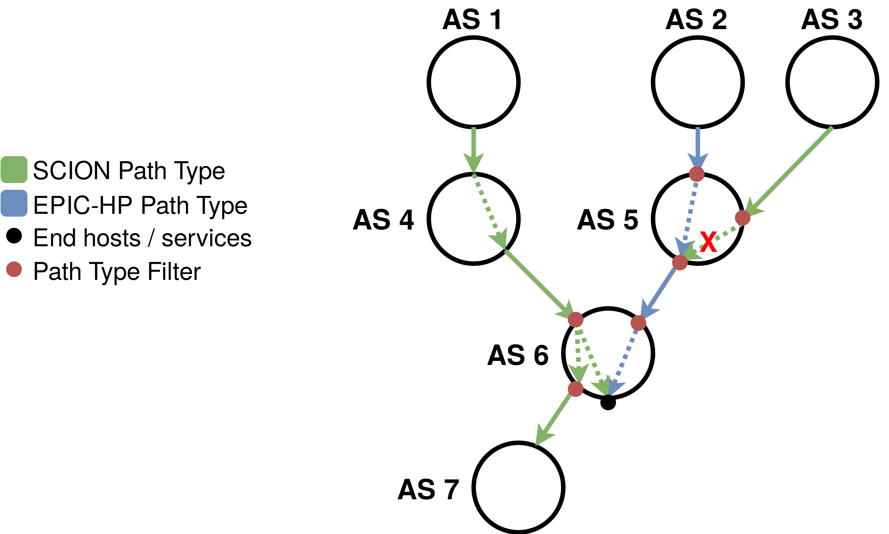

# EPIC Design 

This file introduces EPIC and documents the design rationales and best practices for EPIC-HP.

## Introduction
One important security property of SCION is that end hosts are not allowed to send packets along arbitrary paths, but only along paths that were advertised by all on-path ASes. 
This property is called *path authorization*. 
The ASes only advertise paths that serve their economic interests, and path authorization protects those routing decisions against malicious end hosts.

In SCION, this is implemented by having the ASes create authenticators during beaconing, which end hosts then have to include in the MAC field of their packets. Those MAC fields prove to the ASes, that the packets are allowed to traverse them.
The MAC fields are static, meaning that they are the same for every packet on that path.

However, this implementation of path authorization is insufficient against more sophisticated adversaries that are able to derive MAC fields, for example by brute-forcing them or by observing them in the data plane packets. Because the MACs are static, once derived MACs for one packet can be reused by the adversary to send arbitrarily many other packets (until the authenticators expire).

The EPIC (Every Packet Is Checked) protocol [[1]](#1) solves this problem by introducing per-packet MACs.
Even if an adversary is able to brute-force the MACs for one packet, the MACs cannot be reused to send any other traffic.
Observing MACs from packets in the data plane does also not help an attacker, as he still needs to derive new MACs for every packet he wants to send over an unauthorized path.
This is especially important for hidden paths [[2]](#2). Hidden paths are paths which are not publicly announced, but only communicated to a group of authorized sources. If one of those sources sends traffic on the hidden path using SCION path type packets, an adversary can observe the MACs and reuse them to send traffic on the hidden path himself. This allows the adversary to reach services that were meant to be hidden, or to launch DOS-attacks directed towards them.
EPIC precludes such attacks, making hidden paths more secure.

## EPIC-HP Overview
EPIC-HP (EPIC for Hidden Paths) provides the improved security properties of EPIC on the very last inter-AS link of a path. It is meant as a lightweight EPIC version and is specifically designed to better protect hidden paths.

### Assumptions

  

### SCION Path Type Responses

  

Add image: Really secure hidden path vs. prioritized path

## Procedures

### Control Plane
Add remaining 10 bytes of authenticator

### Data Plane

## Configuration
Network operators should be able to clearly define which kind of traffic (SCION, EPIC-HP, EPIC-SAPV, and other protocols) they want to allow. 
Therefore, for each AS and every interface pair, an AS can be configured with flags to allow only certain types of traffic: 

AllowedTraffic(If_1, If_2) = (flag_SCION, flag_EPIC-HP, flag_COLIBRI, ...)

The order of the interfaces, (If_1, If_2) vs. (If_2, If_1), allows to enable and disable different types of traffic depending on the direction. 
To exclusively allow SCION traffic (default) between interfaces 'x' and 'y' we would set:

AllowedTraffic(x, y) = (1, 0, 0, ...)

And similarly to only allow EPIC-HP traffic:

AllowedTraffic(x, y) = (0, 1, 0, ...)

## Best Practices

### Highly Secure Hidden Paths
The last and penultimate AS on the hidden path only allow EPIC-HP traffic on the affected interface pair.
Add image 

### DoS-Secure Hidden Paths

## References
<a id="1">[1]</a> 
M. Legner, T. Klenze, M. Wyss, C. Sprenger, A. Perrig. (2020)
EPIC: Every Packet Is Checked in the Data Plane of a Path-Aware Internet
Proceedings of the USENIX Security Symposium 
[[Link]](https://netsec.ethz.ch/publications/papers/Legner_Usenix2020_EPIC.pdf)

<a id="2">[2]</a> 
Design Document for the Hidden Path Infrastructure
[[Link]](https://scion.docs.anapaya.net/en/latest/HiddenPaths.html)

